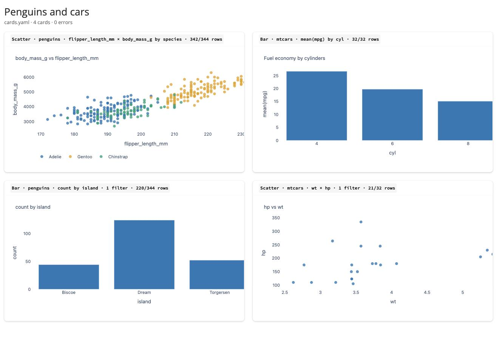
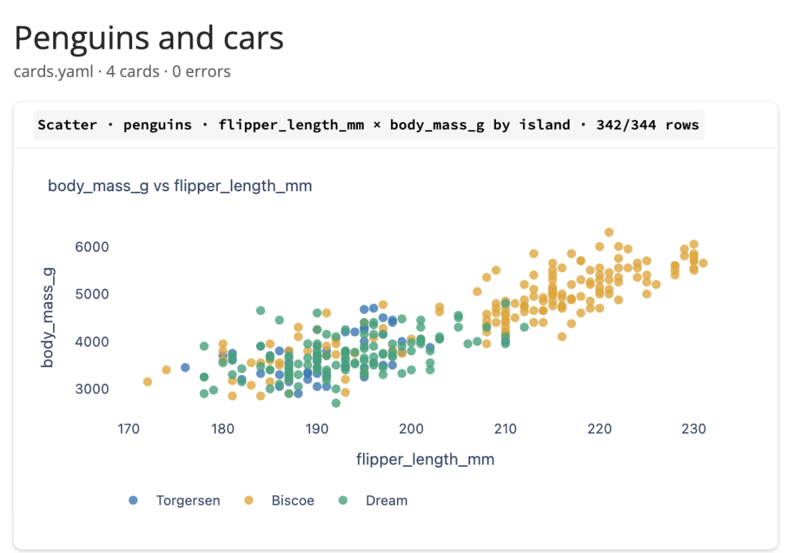
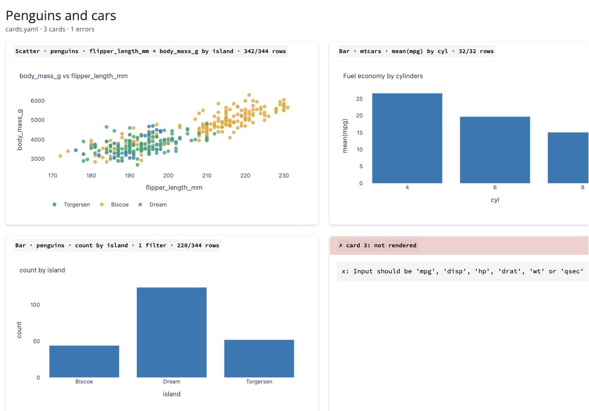

# Config-driven dashboard: a YAML file fills the same PlotSpec, and no model is involved

Second `dynamic-dashboard` stack. The contract is the one the LLM filled in
[`genui-controlled-nextjs`](../genui-controlled-nextjs) — now written in Pydantic, filled by
a human in `cards.yaml`, rendered by Shiny for Python with Plotly, and re-read from disk
every second so editing the file *is* editing the dashboard. Family design:
[`docs/design/dynamic-dashboard.md`](../../../docs/design/dynamic-dashboard.md).

Verified 2026-09-03 on macOS / Apple Silicon, Python 3.13.2, uv, Shiny 1.7.0, Plotly 7.0.0, Pydantic 2.13.5, polars 1.44.1.

---

## Quick start

```bash
just setup       # uv sync --frozen
just check       # ruff + the three evidence tests (equivalence, contract, errors) — no server
just prove       # the same evidence as markdown, for this README — no server, no model
just dev         # http://localhost:8000 — now edit cards.yaml and watch
just smoke       # GET / and the locally served plotly.min.js (another shell)
just catalog     # the contract as JSON Schema, from Pydantic
just fixtures    # refresh the vendored nextjs outputs + catalog (runs the sibling's recipes)
```

There is no container and no API key. `just` alone lists recipes.

---

## What the app is

**Question it answers:** is the PlotSpec a good *human* authoring surface with no LLM at
all — and does the same spec produce the same result in a second language, from a file?

### Dataflow

```
 cards.yaml ─── reactive.file_reader (1 s) ──► yaml.safe_load
                                                │
                                                ▼
                      DashboardHeader (title, columns, cards: raw list)
                                                │  each card on its own
                                 ┌──────────────┴──────────────┐
                                 ▼                             ▼
                    Card = PlotSpec + kind + title?      ValidationError
                    (Pydantic, discriminated on            → ErrorCard in its slot:
                     kind:dataset)                           field · rule · legal values
                                 │
                                 ▼
                    build(): clean → apply_filters → drop_incomplete → group_aggregate   (polars)
                                 │   {kind, spec, points|bars, meta, summary} — same keys as output.ts
                                 ▼
                    scatter_figure / bar_figure → plotly Figure → fig.to_html() → ui.card
                    plotly.min.js served from the installed package, not a CDN
```

### Module split

| file | responsibility |
|---|---|
| `cards.yaml` | the dashboard, declared: title, columns, a list of cards |
| `app/catalog/datasets.py` | the two datasets: column catalogs, polars CSV load, fixed clean step |
| `app/catalog/schema.py` | **the PlotSpec in Pydantic** (per-dataset `Literal` columns, discriminated on `dataset`); Card = PlotSpec + `kind` + `title?`; `DashboardHeader` |
| `app/catalog/transform.py` | the whitelisted ops in polars: `apply_filters`, `drop_incomplete`, `group_aggregate` |
| `app/catalog/build.py` | spec → output dict, key-for-key the nextjs `execute` output; `describe()` caption |
| `app/catalog/config.py` | YAML → `Dashboard` with per-card validation; `ErrorCard` with teaching messages |
| `app/catalog/contract.py` | JSON-Schema vocabulary extractor used to compare Pydantic with Zod |
| `app/builders/*.py` | output → Plotly figure; same palette and layout numbers as the nextjs `theme.ts` |
| `app/dashboard.py` | the only Shiny-aware file: file_reader → validate → build → cards |
| `fixtures/` | `specs.json` (the four Run-2 specs), `nextjs-outputs.json` + `nextjs-catalog.json` (vendored from the sibling), `bad-cards.yaml` |
| `tests/` · `scripts/prove.py` | the evidence, as tests and as markdown |

### Deliberate choices

- **The PlotSpec has no free text; the Card does.** `title` lives on the Card, outside the PlotSpec, so the contract stays byte-identical to the nextjs one and the cutpoint is explicit: copy a person writes is allowed, copy a model writes was not (the nextjs Evidence shows why).
- **Each card validates on its own.** One typo yields one error card and three good ones, never a blank page. The header validates first (`title`, `columns`), then cards individually; a YAML syntax error is the only thing that empties the grid, and it says so in a banner.
- **Equivalence is asserted on computed rows, not on figure JSON.** The content claim lives in points, bars and meta; plotly.py and plotly.js serialise layout defaults differently, and comparing them would test styling, not the contract.
- **Plotly without shinywidgets.** `fig.to_html(include_plotlyjs=False)` inside `ui.HTML`, and `plotly.min.js` served from the installed package via `static_assets`. Zero extra deps, no CDN; Shiny's `render.ui` executes the inline `Plotly.newPlot` script (verified in the browser pass).

---

## Evidence

All of `just prove` is hermetic: no server, no model, no tokens. Pasted verbatim.

### Vendoring the sibling's answers first

```
$ cd ../genui-controlled-nextjs
$ just fixtures ../config-driven-shiny/fixtures/specs.json > ../config-driven-shiny/fixtures/nextjs-outputs.json
$ just catalog > ../config-driven-shiny/fixtures/nextjs-catalog.json
```

`specs.json` holds the four specs the LLM produced in the nextjs stack's Run 2, with a
`kind` added. `nextjs-outputs.json` is what that stack's `execute` returns for them.

### `just prove`

```
$ just prove
## Equivalence — same PlotSpec, our polars build vs the nextjs build

| spec | caption (ours) | items | meta | equal to nextjs |
|---|---|---|---|---|
| `{"dataset":"penguins","x":"flipper_length_mm","y":"body_mass_g","color":"species"}` | Scatter · penguins · flipper_length_mm × body_mass_g by species · 342/344 rows | 342 | `{"n_used": 342, "n_total": 344, "n_filtered": 344, "n_dropped": 2}` | ✓ |
| `{"dataset":"mtcars","by":"cyl","measure":{"op":"mean","column":"mpg"}}` | Bar · mtcars · mean(mpg) by cyl · 32/32 rows | 3 | `{"n_used": 32, "n_total": 32, "n_filtered": 32, "n_dropped": 0}` | ✓ |
| `{"dataset":"penguins","by":"island","measure":{"op":"count"},"filter":[{"column":"species","op":"!=","value":"Gentoo"}]}` | Bar · penguins · count by island · 1 filter · 220/344 rows | 3 | `{"n_used": 220, "n_total": 344, "n_filtered": 220, "n_dropped": 0}` | ✓ |
| `{"dataset":"mtcars","x":"wt","y":"hp","filter":[{"column":"cyl","op":">","value":4}]}` | Scatter · mtcars · wt × hp · 1 filter · 21/32 rows | 21 | `{"n_used": 21, "n_total": 32, "n_filtered": 21, "n_dropped": 0}` | ✓ |

## Contract — vocabulary of the Pydantic PlotSpec vs the Zod PlotSpec

scatter_plot: ✓ identical
  mtcars.color: am, carb, cyl, gear, vs
  mtcars.column: am, carb, cyl, disp, drat, gear, hp, mpg, qsec, vs, wt
  mtcars.op: !=, <, <=, ==, >, >=, in
  mtcars.x: disp, drat, hp, mpg, qsec, wt
  mtcars.y: disp, drat, hp, mpg, qsec, wt
  penguins.color: island, sex, species
  penguins.column: bill_depth_mm, bill_length_mm, body_mass_g, flipper_length_mm, island, sex, species, year
  penguins.op: !=, <, <=, ==, >, >=, in
  penguins.x: bill_depth_mm, bill_length_mm, body_mass_g, flipper_length_mm, year
  penguins.y: bill_depth_mm, bill_length_mm, body_mass_g, flipper_length_mm, year

bar_plot: ✓ identical
  mtcars.by: am, carb, cyl, gear, vs
  mtcars.color: am, carb, cyl, gear, vs
  mtcars.column: am, carb, cyl, disp, drat, gear, hp, mpg, qsec, vs, wt
  mtcars.op: !=, <, <=, ==, >, >=, count, in, mean, median
  penguins.by: island, sex, species
  penguins.color: island, sex, species
  penguins.column: bill_depth_mm, bill_length_mm, body_mass_g, flipper_length_mm, island, sex, species, year
  penguins.op: !=, <, <=, ==, >, >=, count, in, mean, median

## Errors teach — fixtures/bad-cards.yaml

5 cards: 4 rejected, 1 rendered

card 0 `{"kind":"scatter","dataset":"mtcars","x":"weight","y":"hp"}…`
  → x: Input should be 'mpg', 'disp', 'hp', 'drat', 'wt' or 'qsec' (got 'weight')
card 1 `{"kind":"pie","dataset":"penguins","by":"species"}…`
  → card: Input tag 'pie:penguins' found using _card_tag() does not match any of the expected tags: 'scatter:penguins', 'scatter:mtcars', 'bar:penguins', 'bar:mtcars'
card 2 `{"kind":"bar","dataset":"penguins","by":"body_mass_g","measure":{"op":"count"}}…`
  → by: Input should be 'species', 'island' or 'sex' (got 'body_mass_g')
card 3 `{"kind":"bar","dataset":"mtcars","by":"cyl","measure":{"op":"mean","column":"mpg…`
  → filter: List should have at most 3 items after validation, not 4 (got [{'column': 'am', 'op': '==', 'value': 1}, {'column': 'vs…)
```

Four of four outputs equal the nextjs stack's, float for float. Both contracts name
exactly the same columns and operators per dataset. Four bad cards produce four messages
that name the field, the rule and the legal values; the fifth, good card still renders.

### `just check`

```
$ just check
uv run ruff check .
All checks passed!
uv run ruff format --check .
17 files already formatted
uv run pytest -q
.............                                                            [100%]
13 passed in 0.07s
```

### `just smoke` — Plotly is served from the package, not a CDN

```
$ just smoke
GET /                     -> 200
GET /plotly/plotly.min.js -> 200 (4293347 bytes, local)
```

### The dashboard driven in a real browser (Chrome automation, 2026-09-03)

`just dev`, then `localhost:8000` — all four cards, captions identical to the nextjs
stack's, the human `title` on the mtcars bar:



**Live reload.** Changed `color: species` → `color: island` on the first card in
`cards.yaml`. Three seconds later, without touching the browser:



**Errors teach, in place.** Changed `x: wt` → `x: weight` on the fourth card:



Header reads `3 cards · 1 errors`; the message is `x: Input should be 'mpg', 'disp', 'hp',
'drat', 'wt' or 'qsec' (got 'weight')`. No console errors in any of the three states.

---

## ⚠️ Not verified

### ⚠️ Not verified: the right edge of the plots

In the screenshots the Plotly canvas is a few pixels wider than its card: the last x-tick
and the right-most points are clipped. Plotly computes its responsive width when the HTML is
inserted, before Bootstrap's card padding settles. Cosmetic for a PoC, unfixed. To close:
call `Plotly.Plots.resize` after insertion, or give the div an explicit width, and
re-screenshot.

### ⚠️ Not verified: anything beyond four cards and two datasets

`columns: 1` was not looked at; neither was a `cards.yaml` with twenty cards (each
`file_reader` tick rebuilds every card — polars makes that cheap at 344 rows, but nobody
measured it). To close: duplicate the cards to twenty, watch the tick time in the server log.

### ⚠️ Not verified: the YAML-level errors

A malformed YAML file (bad indentation) is handled by the code path in `config.py` and
covered by no test and no screenshot. To close: break the indentation while `just dev`
runs and confirm the red banner.

---

## Lessons worth stealing

- **Don't name the Shiny entry file after its package.** `shiny run app/app.py` imports the file as a module called `app`, which shadows the `app` package and every `from app.catalog import …` fails with "'app' is not a package". `app/dashboard.py` it is.
- **Validate the list, not the document.** Parsing the whole YAML into one model makes a single typo take down every card. Parse the header, then `TypeAdapter(Card).validate_python` each card separately, and render the failures *as cards*.
- **Pydantic's error messages already teach.** `Input should be 'mpg', 'disp', … (got 'weight')` comes free from a `Literal`; the only editing worth doing is dropping the union tag it prepends to the location (`bar:penguins.by` → `by`).
- **A callable `Discriminator` handles two-level unions cleanly.** `kind × dataset` as one tag (`"bar:penguins"`) with `Tag`s avoids nesting discriminated unions, and the mismatch message lists every legal combination.
- **Compare schema vocabulary, not schema shape.** Zod emits `oneOf`; Pydantic emits `$defs` and a discriminator. A 60-line walker that collects `{dataset: {field: enum}}` from either is the cross-language check that actually matters.
- **`uv run shiny run --reload` keeps holding the port after the worker crashes.** The reload supervisor survives an import error in the app; kill it before a retry or the next start dies with "Address already in use".

---

## Not covered

- Any LLM. This stack is the no-model baseline of the family; the chat-driven version on this same catalog is the planned `genui-controlled-shiny`.
- Layout beyond `columns: 1 | 2` and card order. No slots, no sizes, no tabs.
- Docker, deployment, auth, persistence. The file on disk is the state.
- Cost and latency measurements; there is nothing here that costs tokens.

## Data

`data/penguins.csv` (344 rows) and `data/mtcars.csv` (32 rows, R's `mtcars` with the row
names as `model`) are the same files the nextjs stack vendors; `just data` regenerates both.
