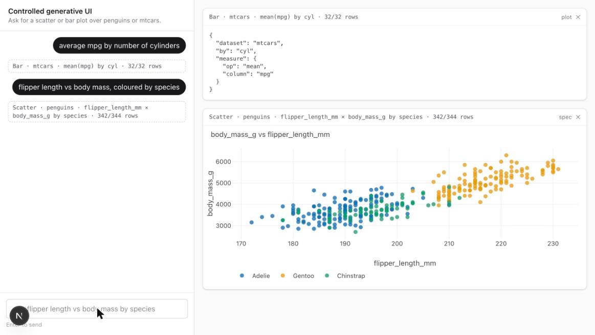

# Controlled generative UI: an LLM picks the plot, a schema decides everything else

The first `dynamic-dashboard` stack. A chat box on the left; every turn the model may do
exactly one kind of thing — call `scatter_plot` or `bar_plot` with typed props — and a
Plotly card lands in the grid on the right. It cannot draw a pie chart, invent a column,
write a caption, or place a card. Family design: [`docs/design/dynamic-dashboard.md`](../../../docs/design/dynamic-dashboard.md).

Verified 2026-09-03 on macOS / Apple Silicon, Node 26.7.0, pnpm 10.18.2, Next.js 16.3.4, AI SDK 7.0.91, model `gpt-5.6-terra`.

---

## Quick start

```bash
cp .env.example .env     # then paste OPENAI_API_KEY
just setup               # pnpm install --frozen-lockfile
just check               # types · lint · transform self-checks (no LLM, no server)
just dev                 # http://localhost:3000
just smoke               # GET / and POST /api/chat answer (another shell)
just catalog             # the contract the model receives, as JSON Schema
just prove               # consistency ×5 per intent + refusal — costs tokens
```

`just` alone lists recipes. There is no container: the question here is about the model
contract, not the transport.

---

## What the app is

**Question it answers:** can an LLM drive a *Controlled-tier* generative UI — select a
prebuilt component and fill its typed props — consistently enough to trust, and what does
the contract that makes it consistent look like?

### Dataflow

```
 browser                     │ server (Next.js route)                      │ OpenAI
                             │                                             │
 ChatRail ──sendMessage──►  /api/chat ──streamText(instructions, tools)──► gpt-5.6-terra
                             │                                             │   picks a tool,
                             │   ◄──────── tool call {name, input} ◄───────┘   fills PlotSpec
                             │   inputSchema (Zod) validates the input
                             │   execute:  penguins.csv / mtcars.csv
                             │             → clean (typed, NA→null)
                             │             → applyFilters · groupAggregate  (whitelisted)
                             │             → {points | bars, meta, summary}
                             │   toModelOutput: only `summary` goes back to the model
 CardGrid ◄── tool-<name> part {state, input, output} ◄── UI message stream
   └─ PlotCard: output → Plotly figure; header caption written from `spec`, flip = spec JSON
```

### Module split

| file | responsibility |
|---|---|
| `src/catalog/datasets.ts` | the two datasets: column catalogs (numeric / categorical), CSV parse, fixed clean step |
| `src/catalog/schema.ts` | **the PlotSpec** — Zod schemas with per-dataset column enums; the whole contract |
| `src/catalog/transform.ts` | the whitelisted ops: `applyFilters`, `dropIncomplete`, `groupAggregate` (pure) |
| `src/catalog/tools.ts` | the two `tool()`s: `execute` = clean → transform → output; `toModelOutput` = summary only |
| `src/catalog/output.ts` | output types + the deterministic caption; client-safe (no `node:fs`) |
| `src/catalog/systemPrompt.ts` | the rules of engagement, one place |
| `src/app/api/chat/route.ts` | the one LLM call; streams UI message parts |
| `src/components/Dashboard.tsx` | owns `useChat`; derives cards from `tool-*` parts, dismiss set |
| `src/components/ChatRail.tsx` · `CardGrid.tsx` · `PlotCard.tsx` | the two slots and the prebuilt component |
| `src/builders/scatter.ts` · `bar.ts` · `theme.ts` | output → Plotly figure; fixed palette, fixed layout |
| `scripts/selfcheck.ts` | transform facts asserted without a model |
| `scripts/catalog.ts` · `prove.ts` · `prompts.json` | the evidence recipes |

### Deliberate choices

- **The model never sees a row.** `execute` returns points/bars to the *card*; `toModelOutput` returns one sentence to the *model*, and `convertToModelMessages(messages, { tools })` applies the same rule to earlier turns. Token use stays flat with dataset size, and there is nothing for the model to "reason about" except the schema.
- **Column enums are per dataset** (`z.discriminatedUnion("dataset", …)`), so `x: "mpg"` on penguins is a validation error before `execute`, not a guess inside it. The cost is a `oneOf` at the schema root; Evidence shows OpenAI accepted it.
- **No model copy reaches the screen.** The first draft allowed an optional `title`; Run 1 in Evidence shows it was the only field that ever drifted, so it was deleted. Captions and plot titles are computed from the spec by the client; refusals are plain text with zero tool calls.
- **Reasoning effort `low`, no temperature.** GPT-5-family models expose no temperature; `low` is the cheapest setting and this is a picking task, not a reasoning task. `just prove` shows whether it is enough.

---

## Evidence

### The contract the model receives

```
$ just catalog | jq -c '.[] | {name, props: (.inputSchema.oneOf[0].properties | keys)}'
{"name":"scatter_plot","props":["color","dataset","filter","x","y"]}
{"name":"bar_plot","props":["by","color","dataset","filter","measure"]}
```

Two tools, five props each, every column an enum. The full JSON Schema (with per-dataset
`oneOf` branches and the `filter` sub-schema) is what `just catalog` prints in full.

### The transform is right before any model is involved

```
$ just check   (last step)
✓ penguins rows: 344
✓ mtcars rows: 32
✓ scatter flipper×mass by species: complete rows: {"n_used":342,"n_total":344,"n_filtered":344,"n_dropped":2}
✓ scatter mtcars hp×wt, cyl>4: rows: 21
✓ bar mean mpg by cyl: [["4",26.66,11],["6",19.74,7],["8",15.1,14]]
✓ bar count by island, Gentoo excluded: [["Biscoe",44],["Dream",124],["Torgersen",52]]
✓ bar median mass by species split by sex (6 bars, sex-null rows dropped): [6,333,…]
✓ filter op in: [["Adelie",152],["Gentoo",124]]
all checks passed
```

The 344 / 342 counts match `dash-docker`'s README; the mtcars means match R's `aggregate(mpg ~ cyl, mtcars, mean)`.

### One real turn through the route

```
$ curl -sN -H 'content-type: application/json' \
    -d '{"messages":[{"id":"u1","role":"user","parts":[{"type":"text","text":"average mpg by number of cylinders"}]}]}' \
    localhost:3000/api/chat | grep -E 'tool-(input|output)-available'
data: {"type":"tool-input-available","toolCallId":"call_…","toolName":"bar_plot","input":{"dataset":"mtcars","by":"cyl","measure":{"op":"mean","column":"mpg"},"title":"Average MPG by Cylinders"}}
data: {"type":"tool-output-available","toolCallId":"call_…","output":{"kind":"bar","spec":{…},"bars":[{"category":"4","group":null,"n":11,"value":26.66…},{"category":"6",…,"value":19.74…},{"category":"8",…,"value":15.10…}],"meta":{"n_used":32,"n_total":32,"n_filtered":32,"n_dropped":0},"summary":"Rendered bar of mtcars: mean mpg by cyl, 3 bars from 32/32 rows."}}
```

OpenAI accepted the `oneOf`-rooted schema (the discriminated union) without complaint;
the model picked the right tool and the right props on the first try. (This turn was
taken before `title` was removed; see the next section for why it was.)

### Run 1 — consistency with an optional free-text `title` in the schema

```
$ just prove
# prove — 5 runs per intent, model gpt-5.6-terra, 2026-09-03

## Consistency

| intent | tool (n/N) | distinct specs | median ms | spec |
|---|---|---|---|---|
| scatter-penguins | scatter_plot (5/5) | 1 | 2193 | `[{"color":"species","dataset":"penguins","x":"flipper_length_mm","y":"body_mass_g"}]` |
| bar-mtcars-mean | bar_plot (5/5) | 1 | 1903 | `[{"by":"cyl","dataset":"mtcars","measure":{"column":"mpg","op":"mean"},"title":"Average MPG by Cylinders"}]` |
| bar-penguins-filter | bar_plot (5/5) | 2 | 1868 | `[{"by":"island","dataset":"penguins","filter":[{"column":"species","op":"!=","value":"Gentoo"}],"measure":{"op":"count"},"title":"Penguins per island (excluding Gentoo)"}]` |
|   ↳ variant ×2 | | | | `[{"by":"island","dataset":"penguins","filter":[{"column":"species","op":"!=","value":"Gentoo"}],"measure":{"op":"count"},"title":"Penguins per island (Gentoo excluded)"}]` |
|   ↳ variant ×3 | | | | `[{"by":"island","dataset":"penguins","filter":[{"column":"species","op":"!=","value":"Gentoo"}],"measure":{"op":"count"},"title":"Penguins per island (excluding Gentoo)"}]` |
| scatter-mtcars-filter | scatter_plot (5/5) | 5 | 1685 | `[{"dataset":"mtcars","filter":[{"column":"cyl","op":">","value":4}],"title":"Horsepower vs Weight, >4 Cylinders","x":"wt","y":"hp"}]` |
|   ↳ variant ×1 | | | | `[{"dataset":"mtcars","filter":[{"column":"cyl","op":">","value":4}],"title":"Horsepower vs Weight, >4 Cylinders","x":"wt","y":"hp"}]` |
|   ↳ variant ×1 | | | | `[{"dataset":"mtcars","filter":[{"column":"cyl","op":">","value":4}],"title":"Horsepower vs Weight — >4 Cylinders","x":"wt","y":"hp"}]` |
|   ↳ variant ×1 | | | | `[{"dataset":"mtcars","filter":[{"column":"cyl","op":">","value":4}],"title":"Horsepower vs. weight — >4 cylinders","x":"wt","y":"hp"}]` |
|   ↳ variant ×1 | | | | `[{"dataset":"mtcars","filter":[{"column":"cyl","op":">","value":4}],"title":"Horsepower vs weight, >4 cylinders","x":"wt","y":"hp"}]` |
|   ↳ variant ×1 | | | | `[{"dataset":"mtcars","filter":[{"column":"cyl","op":">","value":4}],"title":"Horsepower vs weight — >4 cylinders","x":"wt","y":"hp"}]` |

Intents with any spec drift: 2/4

## Refusal

| prompt | tool calls | reply |
|---|---|---|
| pie chart of penguin species | 0 | I can’t create pie charts. I can add a bar plot of penguin counts by species instead. |
| fit a regression predicting body mass from flipper length and plot it | 0 | I can’t fit or display a regression model. I can add a scatter plot of `flipper_length_mm` versus `body_mass_g` for penguins. |
| show sepal length vs petal length from the iris dataset | 0 | I can’t plot the iris dataset or its sepal/petal columns. I can add scatter or bar plots for the penguins or mtcars datasets using their available columns. |

Out-of-catalog prompts that produced a plot: 0/3
```
error: recipe `prove` failed on line 42 with exit code 1

Tool choice was stable 20/20 and **every structural field was identical in every run**.
The only field that ever varied was `title`, the one prop where the model was allowed to
write prose — and it varied on 2 of 4 intents, in punctuation and casing ("vs" / "vs." /
"—" / ","). Constraining layout but not copy is exactly the drift the generative-UI
literature warns about, reproduced here in five runs.

### Run 2 — the same experiment after deleting `title` from the contract

```
$ just prove
# prove — 5 runs per intent, model gpt-5.6-terra, 2026-09-03

## Consistency

| intent | tool (n/N) | distinct specs | distinct ignoring copy fields | median ms | spec |
|---|---|---|---|---|---|
| scatter-penguins | scatter_plot (5/5) | 1 | 1 | 1613 | `[{"color":"species","dataset":"penguins","x":"flipper_length_mm","y":"body_mass_g"}]` |
| bar-mtcars-mean | bar_plot (5/5) | 1 | 1 | 1747 | `[{"by":"cyl","dataset":"mtcars","measure":{"column":"mpg","op":"mean"}}]` |
| bar-penguins-filter | bar_plot (5/5) | 1 | 1 | 1919 | `[{"by":"island","dataset":"penguins","filter":[{"column":"species","op":"!=","value":"Gentoo"}],"measure":{"op":"count"}}]` |
| scatter-mtcars-filter | scatter_plot (5/5) | 1 | 1 | 1877 | `[{"dataset":"mtcars","filter":[{"column":"cyl","op":">","value":4}],"x":"wt","y":"hp"}]` |

Intents with structural drift (any field but title): 0/4
Intents with copy-only drift (title): 0/4

## Refusal

| prompt | tool calls | reply |
|---|---|---|
| pie chart of penguin species | 0 | I can’t create pie charts. I can add a bar plot of penguin counts by species instead. |
| fit a regression predicting body mass from flipper length and plot it | 0 | I can’t fit or display a regression model. I can add a scatter plot of `flipper_length_mm` versus `body_mass_g` for the penguins dataset. |
| show sepal length vs petal length from the iris dataset | 0 | I can’t plot the iris dataset or its sepal/petal columns. I can add scatter or bar plots for the available **penguins** or **mtcars** columns. |

Out-of-catalog prompts that produced a plot: 0/3
```

Same prompts, same model, same reasoning effort, same day. 20/20 identical specs. The
title the card shows is now derived from the spec on the client; nothing the model writes
reaches the screen except a refusal.

Median latency per turn sat between 1.6 s and 2.2 s across both runs; cost was not
measured (see *Not covered*).

---

## ⚠️ Not verified

### The dashboard driven in a real browser (Chrome automation, 2026-09-03)

Driven through the Claude in Chrome extension against `just dev` on this Mac: clicked the
suggestion *average mpg by number of cylinders*, then typed *flipper length vs body mass,
coloured by species* into the chat rail and pressed Enter.

```
card 1 caption : Bar · mtcars · mean(mpg) by cyl · 32/32 rows
card 1 → spec  : {"dataset":"mtcars","by":"cyl","measure":{"op":"mean","column":"mpg"}}   ← equals Run 2, row 2
card 2 caption : Scatter · penguins · flipper_length_mm × body_mass_g by species · 342/344 rows
console errors : none
dismiss ✕      : both cards removed → empty state "No cards yet" returned
```



Both captions are the client-derived strings, character for character; the spec flip
shows the tool input the model produced, with no `title` field. KS had also driven the
UI by hand earlier the same day, after PR #1 merged.

The first browser pass found two layout bugs no HTTP check could: the card overflowed
the grid so **spec** and **✕** were clipped off the right edge (a CSS-grid `1fr` track
lets a Plotly canvas push its column wider — fixed with `minmax(0,1fr)` + `min-w-0`), and
the legend sat on the x-axis title (fixed with a larger bottom margin). The screenshot
above is from the second pass, after those fixes.

### ⚠️ Not verified: narrow viewports and multi-plot turns

Nothing below 1163 px wide was looked at, and no prompt asked for two plots in one turn
(the model may emit two tool calls in one step; the grid would render both, untested).
To close: `just dev`, resize to a phone width and check the two-column grid degrades;
ask "show me both mpg by cyl and hp vs wt" and count the cards.

### ⚠️ Not verified: N=5 is a smoke test, not a statistic

Two runs × four intents × five repeats is enough to catch a drifting field, not to bound a
drift rate. `just prove 20` raises N; the prompts in `scripts/prompts.json` are the
population, and four of them is a small one.

---

## Lessons worth stealing

- **Split the catalog into a server half and a client half at the `node:fs` line.** The client needs the *types* of the tool outputs and the caption helper; the moment a client component imports the module that also loads CSVs, Turbopack fails the page with "does not support external modules (node:fs)". `output.ts` (client-safe) vs `tools.ts` (server) is the seam.
- **`toModelOutput` is the cheapest determinism lever you have.** Whatever the tool returns to the model is what the model will paraphrase, summarise, or get distracted by on the next turn. Return a sentence.
- **Type the union before you type the tool.** `z.discriminatedUnion` over datasets gives the model every legal column inside the schema; execute-time validation would have given it a retry loop instead.
- **AI SDK 7 stream errors are masked by default** — the client sees "An error occurred." Pass `onError` to `toUIMessageStream` in a PoC so a missing key or bad model id reads as itself.
- **`next dev` writes `AGENTS.md`/`CLAUDE.md` into the project** unless `agentRules: false` is set in `next.config.ts`. In a monorepo with a root `AGENTS.md`, that is noise.
- **Run TS scripts with `node --import tsx`, not the `tsx` CLI**, when a sandbox is in play: the CLI opens an IPC pipe in the system temp dir.

---

## Not covered

- Cost: latency and tokens per turn were dropped from the evidence set by choice; the numbers are in the OpenAI dashboard, not here.
- Multi-plot turns ("show me both …") — the model may emit two tool calls in one step; the grid renders both, but no prompt in `prove` exercises it.
- Any tier beyond Controlled: no layout, no styling, no copy is model-authored. The declarative and config-driven variants are separate stacks.
- Docker, deployment, auth. The route trusts whoever can reach `:3000`.
- Persistence: cards live in React state; reload and they are gone.

## Data

`data/penguins.csv` is the same 344-row file `dash-docker` vendors; `data/mtcars.csv` is
R's `datasets::mtcars` with the row names as a `model` column. `just data` regenerates
both (needs R on PATH).
