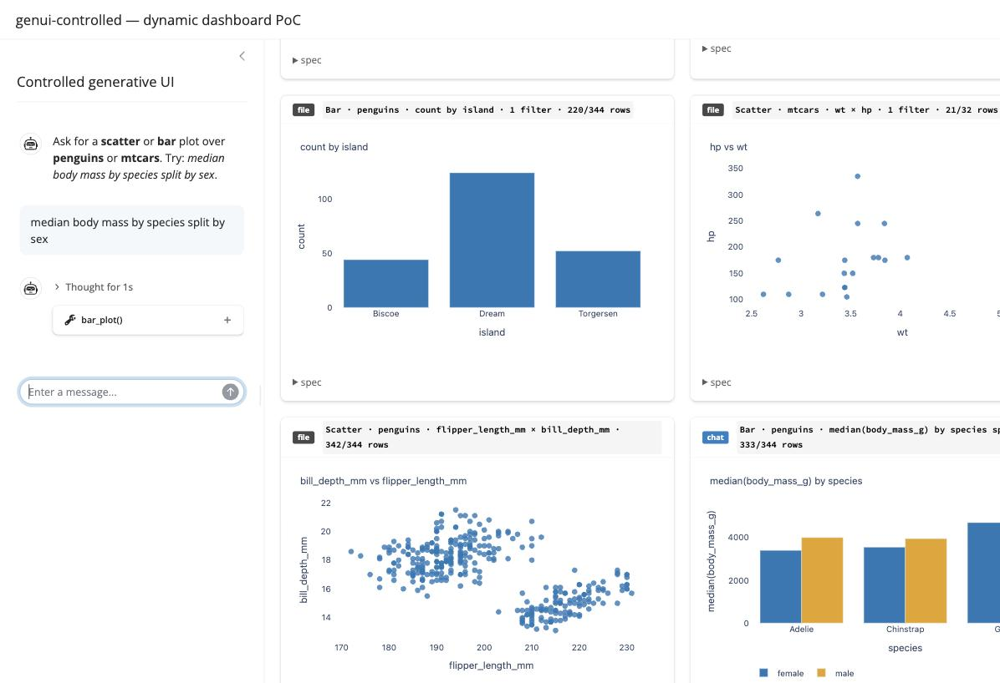
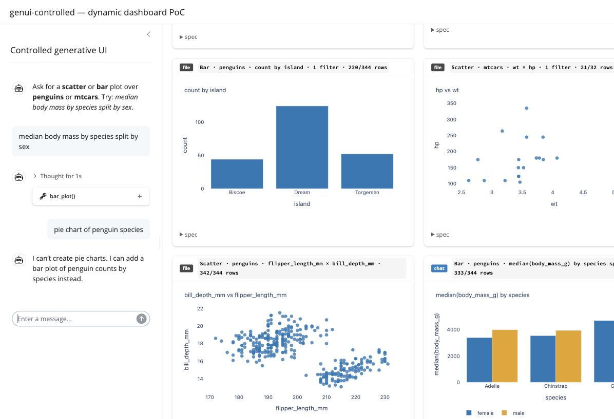

# Controlled generative UI in Python: a chat pane on the catalog a YAML file already fills

Third `dynamic-dashboard` stack. The grid starts from `cards.yaml` (the config-driven
stack's file, every card badged `file`) and a chat pane appends cards the model builds
through two chatlas tools (badged `chat`). The tools' parameter schema *is* the Pydantic
PlotSpec — the contract PR #2 proved equal to the nextjs stack's Zod one — so this stack
asks the nextjs question on the other side of the language line: does the model fill
the same contract as consistently through Python + chatlas, and with the same specs?
Family design: [`docs/design/dynamic-dashboard.md`](../../../docs/design/dynamic-dashboard.md).

Verified 2026-09-03 on macOS / Apple Silicon, Python 3.13.2, uv, Shiny 1.7.0, chatlas 0.22.0, openai 3.7.0, Plotly 7.0.0, Pydantic 2.13.5, polars 1.44.1, model `gpt-5.6-terra`.

---

## Quick start

```bash
cp .env.example .env     # then paste OPENAI_API_KEY
just setup               # uv sync --frozen
just check               # ruff + hermetic tests: tool schema vocabulary, tool behaviour, seed — no model
just dev                 # http://localhost:8000 — seeded grid; type in the sidebar
just smoke               # GET / and the locally served plotly.min.js (another shell)
just catalog             # the tool schemas exactly as chatlas sends them
just prove               # consistency ×5 · refusal · cross-stack equality — costs tokens
```

`just` alone lists recipes. No container.

---

## What the app is

**Question it answers:** does an LLM fill the PlotSpec consistently in Python + chatlas,
and does it produce the *same* specs as the TypeScript + AI SDK stack for the same
prompts — with a file and a chat filling one grid?

### Dataflow

```
 cards.yaml ──► load_dashboard() ──► build() ──► cards (source: file) ──┐
                                                                        ├──► grid: badge per source,
 chat pane ──► chatlas Chat ── stream_async(content="all") ──► ui.Chat  │    caption from the spec,
                 system prompt: the nextjs one, verbatim                │    <details> = the spec JSON
                 tools scatter_plot / bar_plot                          │
                   parameters: PlotSpec JSON Schema (Pydantic → OpenAI-shaped)
                   func(**args): validate (TypeAdapter) → build (polars) → store.append(Card) ──┘ (source: chat)
                                 return summary            ← one sentence back to the model, never rows
                 a second model call writes the closing text (chatlas' loop)
```

### Module split

| file | responsibility |
|---|---|
| `app/agent.py` | `SYSTEM_PROMPT` (verbatim port), `to_openai_params()`, `make_tools(store)`, `make_chat(store)`, `turn(prompt)` for `prove` |
| `app/dashboard.py` | the only Shiny-aware file: seed from the file, `ui.Chat`, stream, sync chat cards on stream success |
| `app/catalog/*` · `app/builders/*` | copied unchanged from `config-driven-shiny` (stacks share nothing) |
| `cards.yaml` | the seed — the config-driven stack's file as committed |
| `fixtures/` | `nextjs-catalog.json` (Zod schema, for the vocabulary test), `nextjs-run2-specs.json`, `prompts.json` (same prompts as the nextjs `prove`) |
| `tests/test_tools.py` · `test_seed.py` | hermetic: schema vocabulary == Zod's, descriptions match, valid args build, bad args rejected, seed loads |
| `scripts/prove.py` | the evidence: consistency ×N, refusal, cross-stack |

### Deliberate choices

- **Tool parameters come from the PlotSpec adapters, not from a hand-written model.** `to_openai_params(ScatterSpecAdapter.json_schema())` — the same vocabulary the contract test pins to Zod's, then three keyword edits OpenAI requires (see Lessons). No second source of truth.
- **The system prompt is the nextjs one, verbatim.** So the variables between the two stacks are the language, the SDK and its defaults, and nothing about the instructions.
- **Cards are appended when the stream *succeeds*, from a reactive effect on `chat.latest_message_stream.status()`**, not inside the stream. Shiny forbids reading reactive values inside an extended task; the tools write to a plain list and the effect moves it across.
- **The file's cards are the human's; chat cards are ephemeral.** Nothing writes back to `cards.yaml`. "Save this dashboard" is the obvious next slice, and is listed under Not covered.

---

## Evidence

### `just check`

```
$ just check
uv run ruff check .
All checks passed!
uv run ruff format --check .
16 files already formatted
uv run pytest -q
......                                                                   [100%]
6 passed in 0.09s
```

The vocabulary test compares the parameters chatlas will send with the vendored Zod
catalog — the two tools name identical columns and operators per dataset.

### `just prove` — run A

The first complete run after the schema was accepted. Two things to see: the model
spells out `null` for optional fields it did not use (a representation difference — the
validated spec drops them), and on *horsepower vs weight* it swapped x and y in 2 of 5 runs.

```
$ just prove
# prove — 5 runs per intent, model gpt-5.6-terra, chatlas, 2026-09-03

## Consistency

| intent | tool (n/N) | distinct specs | median ms | spec |
|---|---|---|---|---|
| scatter-penguins | scatter_plot (5/5) | 1 | 3313 | `[{"color":"species","dataset":"penguins","x":"flipper_length_mm","y":"body_mass_g"}]` |
| bar-mtcars-mean | bar_plot (5/5) | 1 | 4513 | `[{"by":"cyl","color":null,"dataset":"mtcars","filter":null,"measure":{"column":"mpg","op":"mean"}}]` |
| bar-penguins-filter | bar_plot (5/5) | 1 | 4242 | `[{"by":"island","dataset":"penguins","filter":[{"column":"species","op":"!=","value":"Gentoo"}],"measure":{"op":"count"}}]` |
| scatter-mtcars-filter | scatter_plot (5/5) | 2 | 4736 | `[{"color":null,"dataset":"mtcars","filter":[{"column":"cyl","op":">","value":4}],"x":"wt","y":"hp"}]` |
|   ↳ variant ×3 | | | | `[{"color":null,"dataset":"mtcars","filter":[{"column":"cyl","op":">","value":4}],"x":"wt","y":"hp"}]` |
|   ↳ variant ×2 | | | | `[{"color":null,"dataset":"mtcars","filter":[{"column":"cyl","op":">","value":4}],"x":"hp","y":"wt"}]` |

## Refusal

| prompt | tool calls | reply |
|---|---|---|
| pie chart of penguin species | 0 | I can’t create pie charts. I can add a bar chart showing the count of penguins by species. |
| fit a regression predicting body mass from flipper length and plot it | 0 | I can’t fit or plot a regression model. I can add a scatter plot of **body_mass_g** versus **flipper_length_mm** for the penguins dataset. |
| show sepal length vs petal length from the iris dataset | 0 | I can’t plot the iris dataset or sepal/petal columns. I can add scatter or bar plots for the **penguins** or **mtcars** datasets using their available columns. |

Out-of-catalog prompts that produced a plot: 0/3

## Cross-stack — majority spec here vs the nextjs stack's Run-2 spec

| intent | equal | nextjs Run-2 spec |
|---|---|---|
| scatter-penguins | ✓ | `[{"color":"species","dataset":"penguins","x":"flipper_length_mm","y":"body_mass_g"}]` |
| bar-mtcars-mean | ✗ | `[{"by":"cyl","dataset":"mtcars","measure":{"column":"mpg","op":"mean"}}]` |
| bar-penguins-filter | ✓ | `[{"by":"island","dataset":"penguins","filter":[{"column":"species","op":"!=","value":"Gentoo"}],"measure":{"op":"count"}}]` |
| scatter-mtcars-filter | ✗ | `[{"dataset":"mtcars","filter":[{"column":"cyl","op":">","value":4}],"x":"wt","y":"hp"}]` |

Intents whose majority spec differs from the nextjs stack: 2/4
```

### `just prove` — run B, same day

The `prove` script now compares validated specs and counts raw nulls separately.

```
$ just prove
# prove — 5 runs per intent, model gpt-5.6-terra, chatlas, 2026-09-03

## Consistency

| intent | tool (n/N) | distinct specs | raw nulls | median ms | spec (validated) |
|---|---|---|---|---|---|
| scatter-penguins | scatter_plot (5/5) | 1 | 1/5 | 4016 | `[{"color":"species","dataset":"penguins","x":"flipper_length_mm","y":"body_mass_g"}]` |
| bar-mtcars-mean | bar_plot (5/5) | 1 | 4/5 | 3666 | `[{"by":"cyl","dataset":"mtcars","measure":{"column":"mpg","op":"mean"}}]` |
| bar-penguins-filter | bar_plot (5/5) | 1 | 0/5 | 3693 | `[{"by":"island","dataset":"penguins","filter":[{"column":"species","op":"!=","value":"Gentoo"}],"measure":{"op":"count"}}]` |
| scatter-mtcars-filter | scatter_plot (5/5) | 1 | 4/5 | 3503 | `[{"dataset":"mtcars","filter":[{"column":"cyl","op":">","value":4}],"x":"wt","y":"hp"}]` |

## Refusal

| prompt | tool calls | reply |
|---|---|---|
| pie chart of penguin species | 0 | I can’t create pie charts. I can add a bar plot showing the count of penguins by species. |
| fit a regression predicting body mass from flipper length and plot it | 0 | I can’t fit or display a regression model. I can add a scatter plot of `body_mass_g` versus `flipper_length_mm` (optionally coloured by species, island, or sex). |
| show sepal length vs petal length from the iris dataset | 0 | I can’t plot the iris dataset or its sepal/petal columns. I can add scatter or bar plots for the penguins or mtcars datasets using their available columns. |

Out-of-catalog prompts that produced a plot: 0/3

## Cross-stack — majority spec here vs the nextjs stack's Run-2 spec

| intent | equal | nextjs Run-2 spec |
|---|---|---|
| scatter-penguins | ✓ | `[{"color":"species","dataset":"penguins","x":"flipper_length_mm","y":"body_mass_g"}]` |
| bar-mtcars-mean | ✓ | `[{"by":"cyl","dataset":"mtcars","measure":{"column":"mpg","op":"mean"}}]` |
| bar-penguins-filter | ✓ | `[{"by":"island","dataset":"penguins","filter":[{"column":"species","op":"!=","value":"Gentoo"}],"measure":{"op":"count"}}]` |
| scatter-mtcars-filter | ✓ | `[{"dataset":"mtcars","filter":[{"column":"cyl","op":">","value":4}],"x":"wt","y":"hp"}]` |

Intents whose majority spec differs from the nextjs stack: 0/4
```

Tool choice 20/20 in both runs. Refusals 3/3 in both. Run B: 20/20 identical validated
specs and 4/4 equal to the nextjs stack's Run-2 specs. Run A's x/y swap on the "vs"
prompt is the only structural drift seen on this path; the nextjs stack never showed it
in its two runs, and with N=5 that is a hint, not a rate. Median latency 3.5–4.5 s per
turn against 1.6–2.2 s in nextjs: chatlas' `chat()` makes a second model call after the
tool result to write the closing sentence, which the AI SDK route did not.

### `just smoke`

```
$ just smoke
GET /                     -> 200
GET /plotly/plotly.min.js -> 200 (4293347 bytes, local)
```

### The dashboard driven in a real browser (Chrome automation, 2026-09-03)

Typed *median body mass by species split by sex* into the sidebar. The chat pane shows
the model's `bar_plot()` call; the header ticks to `5 from cards.yaml · 1 from chat`; the
sixth card wears a `chat` badge and grouped bars by sex:



Then *pie chart of penguin species*: a refusal in text, no tool call, no card.



Before the key was pasted, the same input produced a chat message saying the model could
not start and why, with the seeded grid intact — the missing key is a message, not a crash.

---

## ⚠️ Not verified

### ⚠️ Not verified: one prompt, one card

The browser pass added one card and refused one request. Multi-turn behaviour — asking
for a second plot in the same conversation, referring back ("now split that by island") —
was not exercised, and chatlas keeps history, so the second turn sees the first tool
result summary. To close: `just dev`, ask for three plots in a row, then a follow-up that
refers to the previous one.

### ⚠️ Not verified: the drift rate on "vs"

One run swapped x/y on 2 of 5; the next run swapped none. Neither run is big enough to
say which is typical. To close: `just prove 20` and read the `scatter-mtcars-filter` row.

### ⚠️ Not verified: the right edge of the plots

Same few clipped pixels as the config-driven stack (Plotly sizes before card padding
settles). Cosmetic, unfixed.

---

## Lessons worth stealing

- **chatlas defaults every tool to `strict: true`, and OpenAI strict mode forbids a union at the root.** The AI SDK defaults to non-strict, which is the whole reason the same contract passed there. `Tool(..., strict=False)` is the fix; the three 400s on the way there said "'oneOf' is not permitted", "schema must have type 'object'", then "must not have anyOf at the top level" (the strict-mode message).
- **`register_tool(Tool)` rebuilds the schema from the function signature** and loses anything you put in `parameters`; `register_tool(func, model=RootModel)` refuses a `root` field. Put the `Tool` in `chat._tools` yourself — it is one dict entry.
- **Three keyword edits turn a Pydantic discriminated union into an OpenAI-shaped schema**: `oneOf` → `anyOf`, drop `discriminator`, add `type: "object"` at the root. Vocabulary untouched; the contract test still passes on the result.
- **Optional fields become `anyOf [.., null]` in Pydantic's schema, and the model then writes the nulls** — in 9 of 20 runs here, never on the Zod path where optional means absent. Compare validated specs, not raw arguments, or the same answer looks like two.
- **Shiny will not let an extended task read reactive values.** Streaming runs as one; collect tool results in a plain list and sync from `chat.latest_message_stream.status()`.
- **`await` chatlas' `stream_async` before handing it to `append_message_stream`** — it returns a coroutine, and Shiny's error ("wrap_async_iterable requires an Iterable") does not say so.
- **`shiny run` reads `.env` once at import.** Pasting the key later needs a restart; `--reload` only watches `app/`.

---

## Not covered

- Writing chat cards back to `cards.yaml`; dismissing cards; keying cards by tool-call id.
- Any tier beyond Controlled; any layout knob beyond the file's `columns`.
- Cost. Latency is in the tables; tokens are in the OpenAI dashboard.
- Docker, deployment, auth. The route trusts whoever reaches `:8000`.

## Data

`data/penguins.csv` and `data/mtcars.csv` are the family's vendored files; `just data`
regenerates both.
